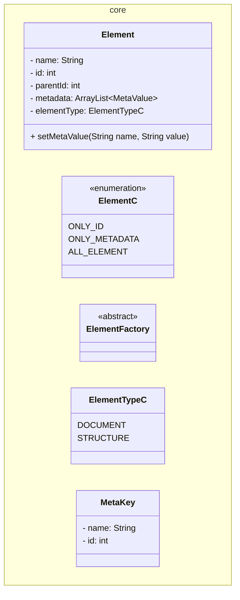

```mermaid
classDiagram
namespace core {

    class Element {
        - name: String
        - id: int
        - parentId: int
        - metadata: ArrayList~MetaValue~
        - elementType: ElementTypeC

        + setMetaValue(String name, String value)
    }

    class ElementC {
        <<enumeration>>
        ONLY_ID
        ONLY_METADATA
        ALL_ELEMENT
    }
    
    class ElementFactory {
        <<abstract>>

    }

    class ElementTypeC {
        DOCUMENT
        STRUCTURE
    }

    class MetaKey {
        - name: String
        - id: int
        
    }
}
```