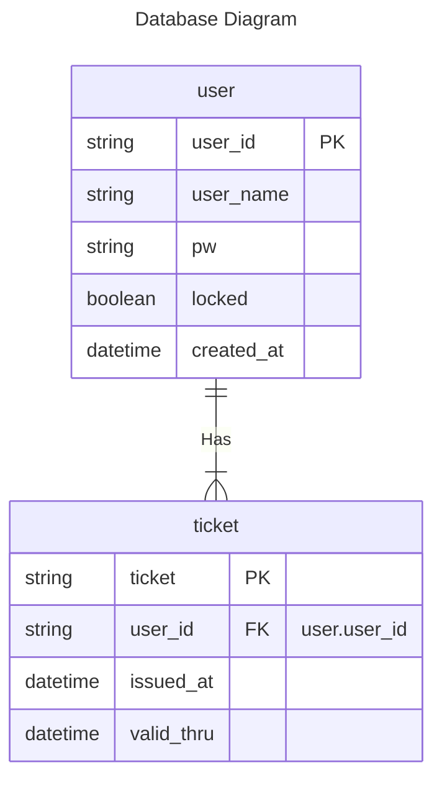

```mermaid
---
title: Database Diagram
---

erDiagram
    user {
        string user_id PK
        string user_name
        string pw
        boolean locked
        datetime created_at
    }

    ticket {
        string ticket PK
        string user_id FK "user.user_id"
        datetime issued_at
        datetime valid_thru
    }

    user ||--|{ ticket: "Has"

```