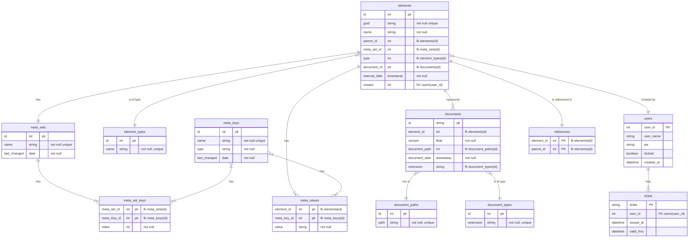

```mermaid
erDiagram

users {
    int user_id PK
    string user_name
    string pw
    boolean locked
    datetime created_at
}

ticket {
    string ticket PK
    int user_id "FK users(user_id)"
    datetime issued_at
    datetime valid_thru
}

elements {
    id int pk
    guid string "not null unique"
    name string "not null"
    parent_id int "fk elements(id)"
    meta_set_id int "fk meta_sets(id)"
    type int "fk element_types(id)"
    document_id int "fk documents(id)"
    internal_date timestamp "not null"
    creator int "FK users(user_id)"
}

element_types {
    id int pk
    name string "not null, unique"
}

meta_keys {
    id int pk
    name string "not null unique"
    type string "not null"
    last_changed date "not null"
}

meta_sets {
    id int pk
    name string "not null unique"
    last_changed date "not null"
}

meta_set_keys {
    meta_set_id int pk "fk meta_sets(id)"
    meta_Key_id int pk "fk meta_keys(id)"
    index int "not null"
}

meta_values {
    element_id int pk "fk elements(id)"
    meta_key_id int pk "fk meta_keys(id)"
    value string "not null"
}

documents {
    id string pk
    element_id int "fk elements(id)"
    version float "not null"
    document_path int "fk document_paths(id)"
    document_date timestamp "not null"
    extension string "fk document_types(id)"
}

document_types {
    id int pk
    extension string "not null, unique"
}

document_paths {
    id int pk
    path string "not null, unique"
}

references {
    element_id int PK "fk elements(id)"
    parent_id int PK "fk elements(id)"
}

elements ||--|| meta_sets: has
meta_sets ||--|{ meta_set_keys: has
meta_keys }|--|{ meta_set_keys: has
elements ||--|{ meta_values: has
meta_keys }|--|{ meta_values: has
elements }|--|| element_types: "is of type"
elements ||--|{ documents: "represents"
documents }|--|| document_paths: "lies in"

users ||--|{ ticket: "Has"
elements }|--|| users: "Created by"
elements ||--|| references: "Is referenced to"

documents }|--|| document_types: "Is of type"

```