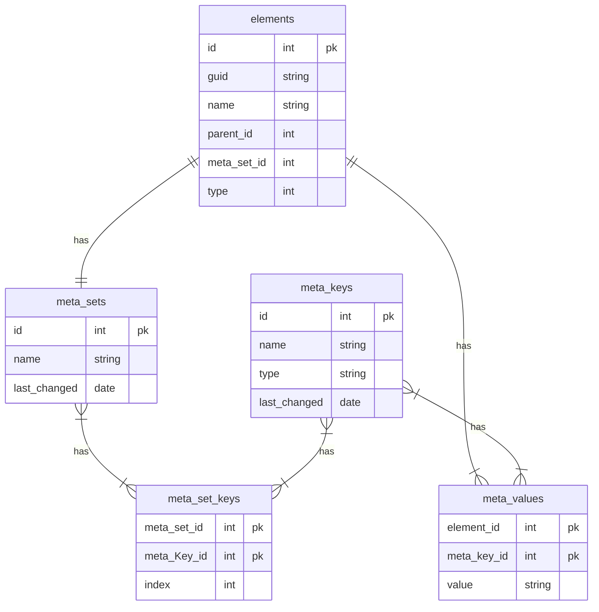

```mermaid
erDiagram

elements {
    id int pk
    guid string
    name string
    parent_id int
    meta_set_id int
    type int
}

meta_keys {
    id int pk
    name string
    type string
    last_changed date
}

meta_sets {
    id int pk
    name string
    last_changed date
}

meta_set_keys {
    meta_set_id int pk
    meta_Key_id int pk
    index int
}

meta_values {
    element_id int pk
    meta_key_id int pk
    value string
}

elements ||--|| meta_sets: has
meta_sets }|--|{ meta_set_keys: has
meta_keys }|--|{ meta_set_keys: has
elements ||--|{ meta_values: has
meta_keys }|--|{ meta_values: has

```